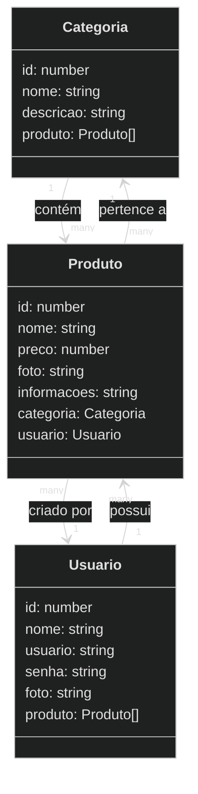

 

    

  

## 1. Descrição
 
O projeto <b>Vammo</b>Vammo é o desenvolvimento de um backend robusto e escalável para um aplicativo de carona compartilhada. Utilizando TypeScript e o framework NestJS, o sistema visa proporcionar uma experiência eficiente e segura para a administração do catálogo de viagens, usuários e veículos, com foco em facilidade de uso e controle de informações.

## 2. Funcionalidades do projeto
 

  2.1 Gerenciamento de Viagens:
   
  Permite adicionar novas viagens ao sistema com as seguintes informações:
   
  - ID
  - Origem
  - Destino
  - Data e hora da ida
  - Preço
  - Distancia entre origem e destino
  - Veículo
  - Status da viagem
  - Nota
 
  Consulta de Viagem:
 
  - Listagem de todas as viagens.
  - Busca por ID.
  - Visualização de cálculo do tempo da viagem com base na distância e na velocidade média do veículo.
    
   
  Atualização de Viagem:
     
  - Altera a origem, destino, data da ida, preço, distância, veículo, status e nota de uma viagem existente.
  
    

  2.2 Gerenciamento de Veículos:
 
Permite adicionar novos produtos ao sistema com as seguintes informações:
- ID
- Modelo
- Placa
- Data de fabricação
- Observação
- Disponibilidade
 
Consulta de Veículos:
- Busca avançada por modelo, placa e data de fabricação, observação e disponibilidade.
- Visualização detalhada do perfil de um veículo.
 
Atualização de Dados:
- Alterar modelo, placa, data de fabricação, observação e disponibilidade.
  

2.3 Gerenciamento de Usuários:
 
  Permite adicionar novos usuários ao sistema com as seguintes informações:
   
  - ID
  - Tipo de usuário
  - Genero
  - Nome
  - Data de Nascimento
  - Usuário
  - Senha
  - Foto
  - Avaliação
   
  Consulta de Usuários:
 
  - Busca avançada por nome e usuário.
  - Visualização detalhada do perfil de um usuário.
   
  Atualização de Dados:
 
  - Alterar informações cadastrais, como nome, usuário ou foto.

  
------

 

## 2. Sobre esta API

<strong>Nest (NestJS)</strong> é uma estrutura para a construção de aplicativos Node.js do lado do servidor eficientes e escalonáveis. Ele usa JavaScript progressivo, é construído e oferece suporte total a TypeScript (mas ainda permite que os desenvolvedores codifiquem em JavaScript puro) e combina elementos de OOP (Programação Orientada a Objetos), FP (Programação Funcional) e FRP (Programação Funcional Reativa).
Nos bastidores, o Nest faz uso de estruturas robustas de servidor HTTP como o Express (o padrão) e, opcionalmente, pode ser configurado para usar o Fastify também!

O Nest fornece um nível de abstração acima desses Node.js comuns frameworks (Express/Fastify), mas também expõe suas APIs diretamente ao desenvolvedor. Isso dá aos desenvolvedores a liberdade de usar uma infinidade de módulos de terceiros disponíveis para a plataforma subjacente.
  

### 2.1. Principais Funcionalidades
 
- Estrutura Modular
- Suporte a TypeScript
- Injeção de dependências
- Testes facilitados
- Controlleres e Rotas
- Validação e serialização
- Integração com bibliotecas externas

------

  

## 3. Diagrama de Classes

# 

---

------

 

## 4. Diagrama Entidade-Relacionamento (DER)

    

------

 

## 5. Tecnologias utilizadas

| Item                          | Descrição  |
| ----------------------------- | ---------- |
| **Servidor**                  | Node JS    |
| **Linguagem de programação**  | TypeScript |
| **Framework**                 | Nest JS    |
| **ORM**                       | TypeORM    |
| **Banco de dados Relacional** | MySQL      |
| **Deploy**                    | Swagger    |
|                               | Render     |

------

 

## 6. Configuração e Execução

1. Clone o repositório
2. Instale as dependências: `npm install`
3. Configure o banco de dados no arquivo `app.module.ts`
4. Execute a aplicação: `npm run start:dev`

------

 

## 7. Colaboradores

`@ZarathosFreya`
`@Beatriz-Rodrigues-P`
`@brunop-lima`
`@emilyestvz`
`@fern-menezes`
`@Josadack`
`@VictorPestana`
